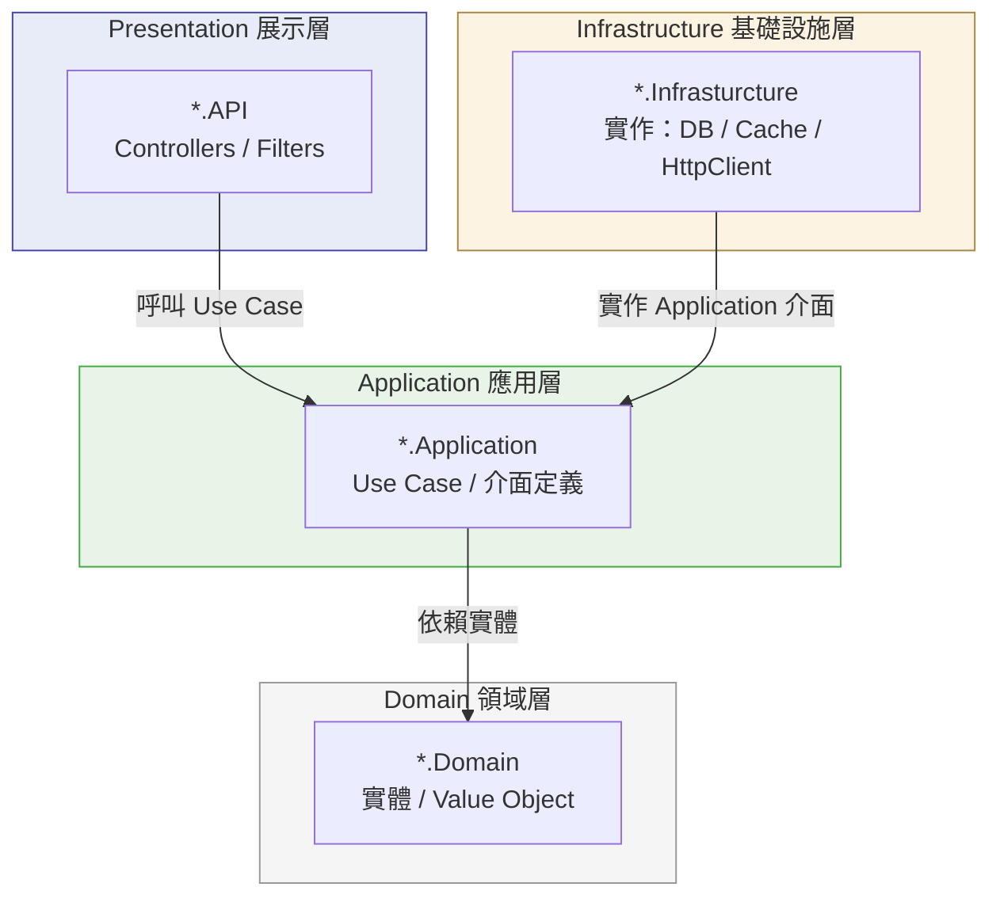
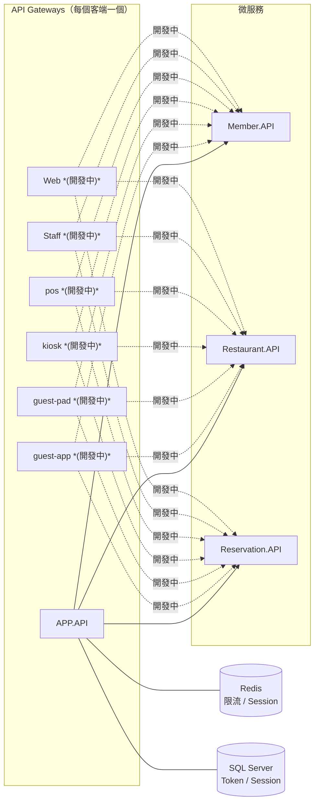

# Sushi.All.Core

壽司餐廳後端服務，提供餐廳查詢、訂位、叫號等功能。  
採 API Gateway + 微服務架構，閘道統一處理認證（JWT）與限流（Token Bucket）。

## 功能
- [x] 會員登入（JWT + Refresh Token Rotation）
- [x] 餐廳列表查詢
- [ ] 訂位（開發中）
- [ ] 叫號查詢（開發中）

---

## 架構

### Clean Architecture

本專案**所有服務**（API Gateway 與各微服務）皆採用 **Clean Architecture**，依賴方向由外向內，內層不感知外層。



**依賴規則：** Domain ← Application ← Presentation；Infrastructure 實作 Application 定義的介面，不由 Domain / Application 直接引用外部框架。

### 服務流程

系統依**客端類型**設置獨立 API Gateway，各 Gateway 均採 Clean Architecture，共享同一組下游微服務。



### 各 Gateway 的 Clean Architecture 分層

| Gateway | Presentation | Application | Domain | Infrastructure |
|---------|-------------|-------------|--------|----------------|
| APP | `APP.API` | `ApiGateway.Application` | `ApiGateway.Domain` | `ApiGateway.Infrasturcture` |
| guest-app | *(開發中)* | *(開發中)* | *(開發中)* | *(開發中)* |
| guest-pad | *(開發中)* | *(開發中)* | *(開發中)* | *(開發中)* |
| kiosk | *(開發中)* | *(開發中)* | *(開發中)* | *(開發中)* |
| pos | *(開發中)* | *(開發中)* | *(開發中)* | *(開發中)* |
| Staff | *(開發中)* | *(開發中)* | *(開發中)* | *(開發中)* |
| Web | *(開發中)* | *(開發中)* | *(開發中)* | *(開發中)* |

### 各微服務的 Clean Architecture 分層

| 微服務 | Presentation | Application | Domain | Infrastructure |
|--------|-------------|-------------|--------|----------------|
| 會員 | `Member.API` | *(開發中)* | *(開發中)* | *(開發中)* |
| 餐廳 | `Restaurant.API` | *(開發中)* | *(開發中)* | *(開發中)* |
| 訂位 | `Reservation.API` | *(開發中)* | *(開發中)* | *(開發中)* |

共用工具（不屬於任何單一服務）：

| Project | 職責 |
|---------|------|
| `Sushi.All.Infrastructure` | `Result<T>`、加密工具、Base64URL |
| `Sushi.All.Infrastructure.Web` | ActionFilter 等 Web 共用元件 |

---

## Tech Stack

| 類別       | 技術                                           |
|------------|------------------------------------------------|
| Runtime    | .NET 9 / ASP.NET Core                          |
| Database   | SQL Server + EF Core 9（Code First Migration） |
| Cache      | Redis（StackExchange.Redis）                   |
| Auth       | JWT Bearer + Refresh Token Rotation            |
| Hashing    | HMAC-SHA256（JWT 簽章）、SHA-256（Token 儲存） |
| Rate Limit | Token Bucket（Lua Script 原子執行於 Redis）    |

---

## 專案結構

```
Sushi.All.Core/
├── APP.API/                        # API Gateway 入口（port 5005）
│   ├── Controllers/                # UserController、RestaurantController
│   └── appsettings.json            # 主要設定（JWT Key、Redis、限流政策）
├── ApiGateway.Application/         # Use Case 與 Token 工具（JwtUtil、RefreshTokenUtil）
├── ApiGateway.Domain/              # 實體（JwtClaim、RefreshToken、SessionId、RateLimitKey）
├── ApiGateway.Infrasturcture/      # EF Core（AppDbContext）、Redis、MemberHttpClient
│   └── Caching/token_bucket.lua    # Token Bucket 限流算法
├── Member.API/                     # 帳密驗證微服務（port 5131）
├── Restaurant.API/                 # 餐廳微服務（開發中）
├── Reservation.API/                # 訂位微服務（開發中）
├── Sushi.All.Infrastructure/       # 共用工具：Result<T>、Error、Base64URL、加密
└── Sushi.All.Infrastructure.Web/   # Web 共用：ActionFilter 等
```

---

## Quick Start

**Prerequisites：** .NET 9、SQL Server、Redis

### 本機啟動

1. 設定 `APP.API/appsettings.json`：
   ```json
   "ConnectionStrings": { "SushiSystem": "<SQL Server 連線字串>" },
   "Redis": { "ConnectionString": "localhost:6379" },
   "Member": { "Domain": "http://localhost:5131" }
   ```

2. 依序啟動服務：
   ```bash
   dotnet run --project Member.API    # port 5131
   dotnet run --project APP.API       # port 5005
   ```
   首次啟動 APP.API 時，會自動執行 EF Core Migration 建立資料表。

### Docker

> 尚未提供 Dockerfile / docker-compose，預計後續加入。

---

## API Reference

| Method | Path                | 需要 Auth | 說明                            |
|--------|---------------------|-----------|---------------------------------|
| POST   | `/User/Login`       | 否        | 登入，回傳 Access Token + Refresh Token |
| GET    | `/Restaurant/List`  | JWT       | 查詢餐廳列表（套用 Rate Limit） |

---

## Key Patterns

### `Result<T>`
所有 Use Case 回傳 `Result<T>`，不拋例外；錯誤透過 `Error` 物件傳遞。  
位於 `Sushi.All.Infrastructure/Result/`。

```csharp
// 成功
Result<string>.Success("data");

// 失敗
Result<string>.Failure(Error.Validation("INVALID_INPUT", "帳號格式錯誤"));
```

### Rate Limiting
- `TokenBucketFilter`（ActionFilter）對每個 `userId + route` 執行限流
- 算法透過 Lua Script 在 Redis 原子執行：`ApiGateway.Infrasturcture/Caching/token_bucket.lua`
- 設定位置：`APP.API/appsettings.json → RateLimitPolicy`（Capacity、RefillTokens、RefillIntervalMs）

### JWT + Refresh Token Rotation
- Access Token 有效期：`TokenLifeHour`（預設 48 小時）
- Refresh Token 採 **Family Tracking**：偵測到重複使用時，自動撤銷整個 Family 的所有 Token
- 相關工具類別：`ApiGateway.Application/Utilities/JwtUtil.cs`、`RefreshTokenUtil.cs`
