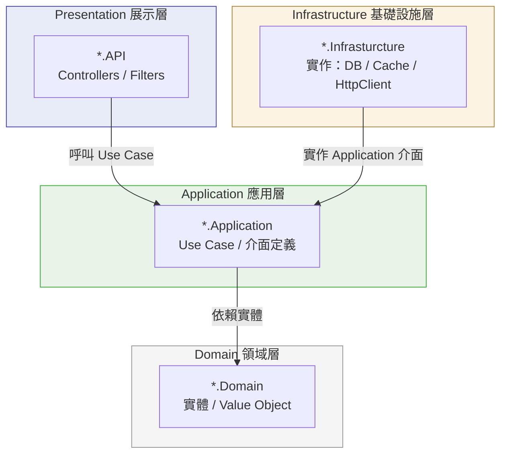
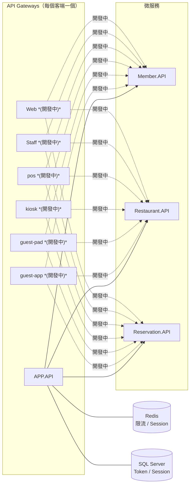
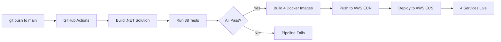

# Sushi.All.Core


[](https://github.com/Anne0214/sushi-core/actions/workflows/deploy.yml)

## Overview

This project is a **cloud-native, microservices-based authentication and API gateway system** built with ASP.NET Core 9, deployed on AWS ECS via a fully automated GitHub Actions pipeline. The architecture follows **Clean Architecture** principles across four independent layers, with loosely-coupled microservices communicating through clearly defined contracts. Key engineering decisions include Redis-backed Token Bucket rate limiting with Lua script atomicity to prevent race conditions, JWT Refresh Token Rotation with token theft detection, and a SQL schema designed for large-scale user growth. The system is covered by **38 test methods across 9 test files**, using Testcontainers for real Redis integration tests and Microsoft.Data.Sqlite for in-memory repository tests.

---

壽司餐廳後端服務，提供餐廳查詢、訂位、叫號等功能。  
採 API Gateway + 微服務架構，閘道統一處理認證（JWT）與限流（Token Bucket）。

## 功能
- [x] 會員登入（JWT + Refresh Token Rotation）
- [x] 餐廳列表查詢
- [ ] 訂位（開發中）
- [ ] 叫號查詢（開發中）

---

## 架構

### Clean Architecture

本專案**所有服務**（API Gateway 與各微服務）皆採用 **Clean Architecture**，依賴方向由外向內，內層不感知外層。



**依賴規則：** Domain ← Application ← Presentation；Infrastructure 實作 Application 定義的介面，不由 Domain / Application 直接引用外部框架。

### 服務流程

系統依**客端類型**設置獨立 API Gateway，各 Gateway 均採 Clean Architecture，共享同一組下游微服務。



### 各 Gateway 的 Clean Architecture 分層

| Gateway | Presentation | Application | Domain | Infrastructure |
|---------|-------------|-------------|--------|----------------|
| APP | `APP.API` | `ApiGateway.Application` | `ApiGateway.Domain` | `ApiGateway.Infrasturcture` |
| guest-app | *(開發中)* | *(開發中)* | *(開發中)* | *(開發中)* |
| guest-pad | *(開發中)* | *(開發中)* | *(開發中)* | *(開發中)* |
| kiosk | *(開發中)* | *(開發中)* | *(開發中)* | *(開發中)* |
| pos | *(開發中)* | *(開發中)* | *(開發中)* | *(開發中)* |
| Staff | *(開發中)* | *(開發中)* | *(開發中)* | *(開發中)* |
| Web | *(開發中)* | *(開發中)* | *(開發中)* | *(開發中)* |

### 各微服務的 Clean Architecture 分層

| 微服務 | Presentation | Application | Domain | Infrastructure |
|--------|-------------|-------------|--------|----------------|
| 會員 | `Member.API` | *(開發中)* | *(開發中)* | *(開發中)* |
| 餐廳 | `Restaurant.API` | *(開發中)* | *(開發中)* | *(開發中)* |
| 訂位 | `Reservation.API` | *(開發中)* | *(開發中)* | *(開發中)* |

共用工具（不屬於任何單一服務）：

| Project | 職責 |
|---------|------|
| `Sushi.All.Infrastructure` | `Result<T>`、加密工具、Base64URL |
| `Sushi.All.Infrastructure.Web` | ActionFilter 等 Web 共用元件 |

---

## CI/CD Pipeline / 自動化部署流程



| Stage | Tool | 說明 |
|-------|------|------|
| Source Control | GitHub | push to `main` 觸發 pipeline |
| Build & Test | GitHub Actions | 編譯 + 執行 38 個測試方法，測試失敗則中斷部署 |
| Image Build | Docker | 4 個微服務各自多階段構建（build image → runtime image） |
| Registry | AWS ECR | 私有 container registry，存放 4 個服務的 image |
| Orchestration | AWS ECS | 4 個服務獨立部署與管理（ap-southeast-2） |

---

## Tech Stack

| 類別       | 技術                                           |
|------------|------------------------------------------------|
| Runtime    | .NET 9 / ASP.NET Core                          |
| Database   | SQL Server + EF Core 9（Code First Migration） |
| Cache      | Redis（StackExchange.Redis）                   |
| Auth       | JWT Bearer + Refresh Token Rotation            |
| Hashing    | HMAC-SHA256（JWT 簽章）、SHA-256（Token 儲存） |
| Rate Limit | Token Bucket（Lua Script 原子執行於 Redis）    |
| Container  | Docker（多階段構建）+ docker-compose           |
| Cloud      | AWS ECS + ECR                                  |
| CI/CD      | GitHub Actions                                 |

---

## Testing Strategy / 測試策略

| Layer | Project | Tools | Tests |
|-------|---------|-------|-------|
| Controller | `APP.API.Tests` | xUnit + Moq | 6 個 |
| Application | `ApiGateway.Application.Tests` | xUnit + Moq + FluentAssertions | 22 個 |
| Infrastructure | `APIGateway.Infrastructure.Tests` | Testcontainers + SQLite | 10 個 |
| **Total** | 3 個測試專案，9 個測試檔案 | coverlet.collector | **38 個方法** |

- **Controller Layer**：以 Moq 隔離 Application Service，驗證 HTTP 回應格式與 Result Pattern 的 mapping 正確性
- **Application Layer**：針對核心業務邏輯進行單元測試，包含 Token Rotation 合法性驗證、Refresh Token 重複使用偵測、JWT Claim 時間窗口計算
- **Infrastructure Layer**：
  - **Testcontainers**：啟動真實 Redis Docker 容器，驗證 Lua Script 限流邏輯在高並行情境下無 Race Condition
  - **Microsoft.Data.Sqlite**：啟動記憶體資料庫，驗證 Repository 的 CRUD 行為與 Unique Index 約束（如重複 HashedToken 應拒絕寫入）

---

## 專案結構

```
Sushi.All.Core/
├── APP.API/                        # API Gateway 入口（port 5005）
│   ├── Controllers/                # UserController、RestaurantController
│   └── appsettings.json            # 主要設定（JWT Key、Redis、限流政策）
├── ApiGateway.Application/         # Use Case 與 Token 工具（JwtUtil、RefreshTokenUtil）
├── ApiGateway.Domain/              # 實體（JwtClaim、RefreshToken、SessionId、RateLimitKey）
├── ApiGateway.Infrasturcture/      # EF Core（AppDbContext）、Redis、MemberHttpClient
│   └── Caching/token_bucket.lua    # Token Bucket 限流算法
├── Member.API/                     # 帳密驗證微服務（port 5131）
├── Restaurant.API/                 # 餐廳微服務（port 5086）
├── Reservation.API/                # 訂位微服務（port 5087）
├── Sushi.All.Infrastructure/       # 共用工具：Result<T>、Error、Base64URL、加密
├── Sushi.All.Infrastructure.Web/   # Web 共用：ActionFilter 等
├── APP.API.Tests/                  # Controller 層測試
├── ApiGateway.Application.Tests/   # Application 層測試
├── APIGateway.Infrastructure.Tests/# Infrastructure 層測試（Testcontainers）
├── docker-compose.yml              # 本機一鍵啟動（SQL Server + Redis + 4 服務）
└── .github/workflows/deploy.yml   # GitHub Actions CI/CD
```

---

## Quick Start

**Prerequisites：** Docker（建議）或 .NET 9 + SQL Server + Redis

### Docker（推薦）

```bash
docker-compose up --build
```

服務啟動後：
- APP API：`http://localhost:5005`
- Member API：`http://localhost:5131`
- Restaurant API：`http://localhost:5086`
- SQL Server：`localhost:1433`（帳號 `sa`，密碼 `YourStrong@Passw0rd`）

首次啟動時，APP.API 會自動執行 EF Core Migration 建立資料表。

### 本機啟動

**Prerequisites：** .NET 9、SQL Server（本機）、Redis（本機 port 6379）

`APP.API/appsettings.json` 預設已指向 `localhost`，使用 Windows 驗證連接 SQL Server，通常不需要修改。若需調整：

```json
{
  "ConnectionStrings": {
    "Default": "Server=localhost;Database=SushiSystem;Trusted_Connection=True;TrustServerCertificate=True;"
  },
  "Redis:ConnectionString": "localhost:6379",
  "Member": { "Domain": "http://localhost:5131" },
  "Restaurant": { "Domain": "http://localhost:5086" }
}
```

依序啟動三個服務：

```bash
dotnet run --project Member.API      # port 5131
dotnet run --project Restaurant.API  # port 5086
dotnet run --project APP.API         # port 5005
```

首次啟動 `APP.API` 時，會自動執行 EF Core Migration 建立資料表。

---

## API Reference

| Method | Path                | 需要 Auth | 說明                            |
|--------|---------------------|-----------|---------------------------------|
| POST   | `/User/Login`       | 否        | 登入，回傳 Access Token + Refresh Token |
| GET    | `/Restaurant/List`  | JWT       | 查詢餐廳列表（套用 Rate Limit） |

---

## Key Patterns

### `Result<T>`
所有 Use Case 回傳 `Result<T>`，不拋例外；錯誤透過 `Error` 物件傳遞。  
位於 `Sushi.All.Infrastructure/Result/`。

```csharp
// 成功
Result<string>.Success("data");

// 失敗
Result<string>.Failure(Error.Validation("INVALID_INPUT", "帳號格式錯誤"));
```

### Rate Limiting

- `TokenBucketFilter`（ActionFilter）對每個 `userId + route` 執行限流
- 算法透過 Lua Script 在 Redis 原子執行：`ApiGateway.Infrasturcture/Caching/token_bucket.lua`
- 設定位置：`APP.API/appsettings.json → RateLimitPolicy`（Capacity、RefillTokens、RefillIntervalMs）

#### Lua Script 原子執行 — 解決 Race Condition

| 方案 | 問題 |
|------|------|
| GET count → 判斷 → DECR（兩步操作） | 並行請求可能都通過 GET 檢查，再各自 DECR，超出限制仍放行 |
| Lua Script 原子執行（目前方案） | Redis 保證 Script 執行期間不插入其他命令，無 Race Condition |

透過 Testcontainers 真實 Redis 環境的並行測試驗證此行為（`RedisRateLimiterTests`）。

### JWT + Refresh Token Rotation

- Access Token 有效期：`TokenLifeHour`（預設 48 小時）
- Refresh Token 採 **Family Tracking**：偵測到重複使用時，自動撤銷整個 Family 的所有 Token
- 相關工具類別：`ApiGateway.Application/Utilities/JwtUtil.cs`、`RefreshTokenUtil.cs`

#### Token Theft Detection

```
Detection Logic:
  IF incoming refresh token exists in DB
     AND token status is "Used" or "Revoked"
  THEN
    → Token reuse detected → assume theft
    → Revoke entire token family (via FamilyId)
    → Force re-authentication for all sessions
```

FamilyId 將同一 Rotation 鏈的所有 token 綁在一起；一旦偵測到重複使用，整個 Family 立即失效，確保即使攻擊者持有舊 token 也無法繼續使用。
